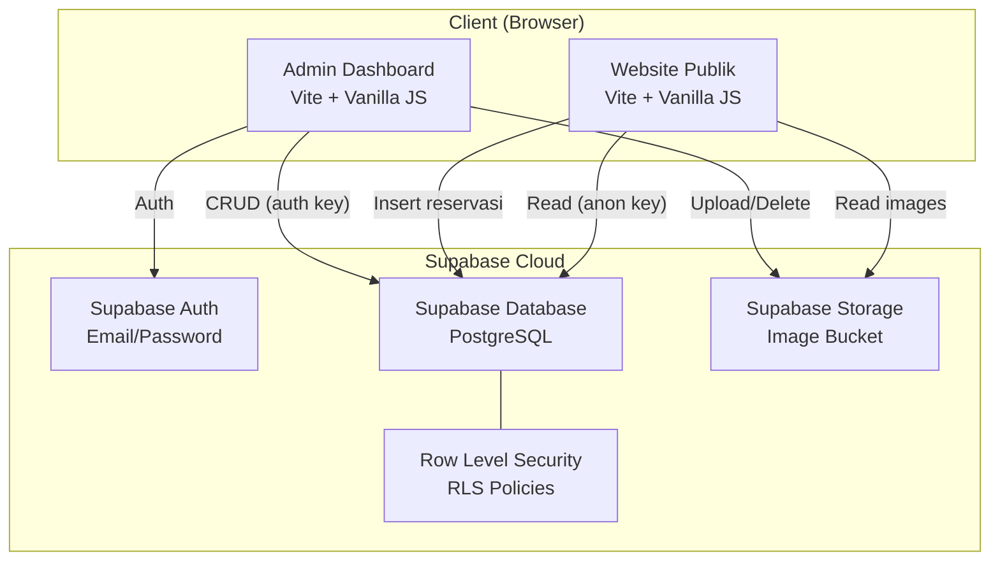
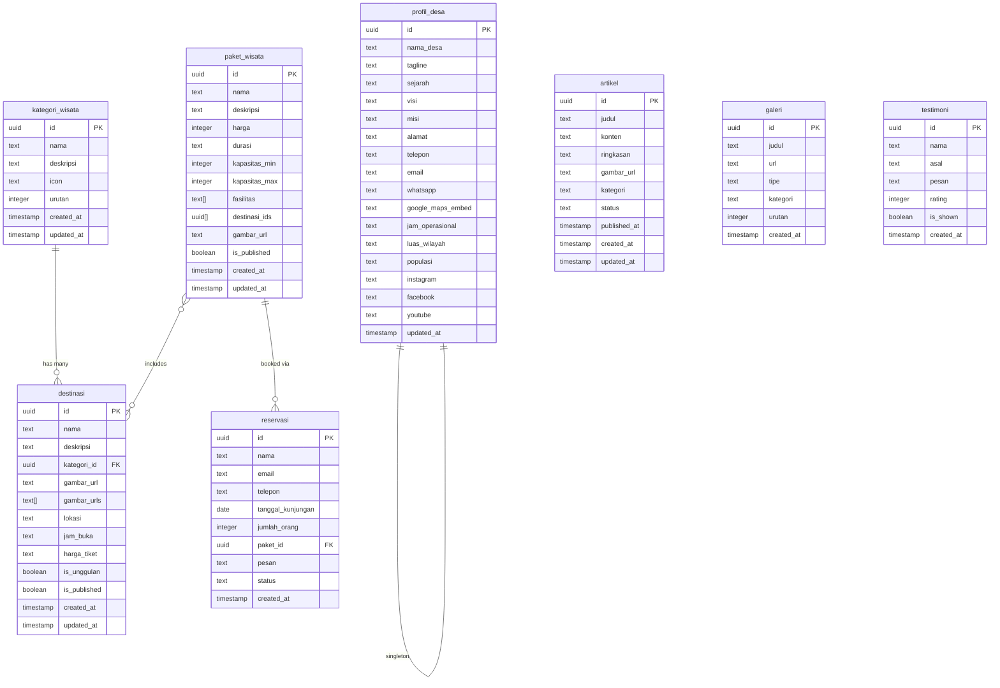

# Software Requirements Specification (SRS)
## Website Desa Wisata Tampirkulon

| Field             | Detail                                      |
|-------------------|---------------------------------------------|
| **Nama Produk**   | Website Desa Wisata Tampirkulon             |
| **Versi Dokumen** | 1.0                                         |
| **Tanggal**       | 22 Juli 2026                                |
| **Status**        | Draft — Menunggu Persetujuan                |
| **Referensi**     | PRD Website Desa Wisata Tampirkulon v1.0    |

---

## 1. Pendahuluan

### 1.1 Tujuan Dokumen

Dokumen ini menjelaskan spesifikasi teknis lengkap untuk pengembangan Website Desa Wisata Tampirkulon. SRS ini menjadi acuan teknis bagi tim pengembang untuk implementasi, testing, dan deployment.

### 1.2 Ruang Lingkup

Sistem terdiri dari:
1. **Website Publik** — Single Page Application (SPA) yang menampilkan informasi wisata desa kepada wisatawan.
2. **Admin Dashboard** — Panel administrasi untuk manajemen konten, wisata, dan reservasi.
3. **Backend** — Supabase sebagai Backend-as-a-Service (BaaS) menyediakan database, autentikasi, dan file storage.

### 1.3 Definisi & Akronim

| Istilah   | Definisi                                                        |
|-----------|-----------------------------------------------------------------|
| SPA       | Single Page Application — website yang dimuat sekali            |
| BaaS      | Backend as a Service                                            |
| CRUD      | Create, Read, Update, Delete                                    |
| RLS       | Row Level Security — kebijakan keamanan level baris di database |
| CTA       | Call to Action — elemen yang mengajak user melakukan aksi       |
| MVP       | Minimum Viable Product                                          |

---

## 2. Arsitektur Sistem

### 2.1 Diagram Arsitektur



### 2.2 Technology Stack

| Layer         | Teknologi                | Versi / Detail                    |
|---------------|--------------------------|-----------------------------------|
| Frontend      | Vite                     | Latest — build tool & dev server  |
| Language      | Vanilla JavaScript (ES6+)| Tanpa framework UI                |
| Styling       | Vanilla CSS              | CSS Custom Properties, Flexbox, Grid |
| Fonts         | Google Fonts             | Outfit (headings), Inter (body)   |
| Backend       | Supabase                 | PostgreSQL, Auth, Storage         |
| Client SDK    | @supabase/supabase-js    | Latest                            |
| Routing       | Custom hash-based router | `#/path` format                   |
| Deployment    | TBD                      | Vercel / Netlify / hosting statis |

### 2.3 Struktur Direktori

```
desawisata/
├── index.html                  # Single HTML entry point
├── package.json
├── vite.config.js
├── .env                        # VITE_SUPABASE_URL, VITE_SUPABASE_ANON_KEY
├── public/
│   ├── images/                 # Generated & static images
│   └── favicon.ico
└── src/
    ├── main.js                 # Entry point, router init
    ├── lib/
    │   └── supabase.js         # Supabase client initialization
    ├── styles/
    │   ├── index.css           # Design tokens & global styles
    │   ├── components.css      # Shared component styles
    │   ├── pages.css           # Public page-specific styles
    │   └── dashboard.css       # Admin dashboard styles
    ├── components/             # Public shared components
    │   ├── navbar.js
    │   ├── footer.js
    │   ├── hero.js
    │   ├── card.js
    │   ├── lightbox.js
    │   └── toast.js
    ├── pages/                  # Public pages
    │   ├── beranda.js
    │   ├── profil.js
    │   ├── destinasi.js
    │   ├── paket.js
    │   ├── galeri.js
    │   ├── blog.js
    │   └── kontak.js
    ├── admin/
    │   ├── components/         # Dashboard shared components
    │   │   ├── sidebar.js
    │   │   ├── header.js
    │   │   ├── data-table.js
    │   │   ├── modal.js
    │   │   ├── form-fields.js
    │   │   └── image-upload.js
    │   └── pages/              # Dashboard pages
    │       ├── login.js
    │       ├── overview.js
    │       ├── destinasi.js
    │       ├── kategori.js
    │       ├── paket.js
    │       ├── artikel.js
    │       ├── profil.js
    │       ├── galeri.js
    │       └── reservasi.js
    ├── data/
    │   └── seed.js             # Initial seed data
    └── utils/
        ├── router.js           # Client-side SPA router
        ├── animations.js       # Scroll & micro animations
        └── auth.js             # Auth helpers & guards
```

---

## 3. Spesifikasi Fungsional

### 3.1 Website Publik

---

#### 3.1.1 Navigasi (Navbar) — `FR-NAV`

| ID       | Requirement                                                                 |
|----------|-----------------------------------------------------------------------------|
| FR-NAV-01| Navbar harus fixed di bagian atas viewport                                  |
| FR-NAV-02| Navbar transparan saat di posisi atas, menjadi solid (dengan backdrop-blur) saat user scroll ke bawah (threshold: 50px) |
| FR-NAV-03| Menampilkan logo/nama desa di sisi kiri                                     |
| FR-NAV-04| Menampilkan menu navigasi di sisi kanan: Beranda, Profil, Destinasi, Paket, Galeri, Blog, Kontak |
| FR-NAV-05| Menu item aktif ditandai dengan indikator visual (underline/highlight)       |
| FR-NAV-06| Pada layar ≤ 768px, menu berubah menjadi hamburger icon dengan slide-in drawer |
| FR-NAV-07| Transisi navbar transparan → solid harus smooth (CSS transition ≥ 300ms)    |

---

#### 3.1.2 Halaman Beranda — `FR-HOME`

| ID        | Requirement                                                                |
|-----------|----------------------------------------------------------------------------|
| FR-HOME-01| **Hero Section**: Full-viewport (100vh) dengan background image            |
| FR-HOME-02| Hero menampilkan overlay gradient (gelap di bawah) untuk readability teks  |
| FR-HOME-03| Hero menampilkan heading (nama desa), tagline (dari DB `profil_desa.tagline`), dan CTA button "Mulai Petualangan" → scroll ke section highlights |
| FR-HOME-04| Hero menampilkan scroll indicator (animated bouncing arrow) di bagian bawah|
| FR-HOME-05| **Section Highlights**: Menampilkan 4 card kategori wisata dari tabel `kategori_wisata` (ORDER BY `urutan`) |
| FR-HOME-06| Setiap highlight card menampilkan icon, nama kategori, dan deskripsi singkat|
| FR-HOME-07| **Destinasi Unggulan**: Menampilkan destinasi dari tabel `destinasi` WHERE `is_unggulan = true AND is_published = true` (maks 3 item) |
| FR-HOME-08| Setiap card destinasi menampilkan gambar, nama, kategori, deskripsi singkat, dan link "Selengkapnya" |
| FR-HOME-09| **Section Tentang**: Menampilkan ringkasan profil desa dan statistik (luas wilayah, populasi, jumlah destinasi, jumlah paket) dari `profil_desa` |
| FR-HOME-10| Statistik ditampilkan dengan counter animation (angka naik dari 0)         |
| FR-HOME-11| **Testimonial**: Carousel/slider dari tabel `testimoni` WHERE `is_shown = true`, menampilkan nama, asal, pesan, rating (bintang) |
| FR-HOME-12| **CTA Section**: Banner ajakan reservasi dengan tombol → `#/kontak`        |
| FR-HOME-13| Semua section memiliki reveal-on-scroll animation (fade-in + slide-up)     |

---

#### 3.1.3 Halaman Profil Desa — `FR-PROF`

| ID        | Requirement                                                                |
|-----------|----------------------------------------------------------------------------|
| FR-PROF-01| Menampilkan sejarah desa dari `profil_desa.sejarah` (markdown → HTML)      |
| FR-PROF-02| Menampilkan visi dari `profil_desa.visi`                                   |
| FR-PROF-03| Menampilkan misi dari `profil_desa.misi` (list format)                     |
| FR-PROF-04| Menampilkan peta lokasi menggunakan Google Maps embed (`profil_desa.google_maps_embed`) |
| FR-PROF-05| Menampilkan info geografis: luas wilayah, populasi, alamat                 |
| FR-PROF-06| Layout 2 kolom pada desktop (teks kiri, peta/gambar kanan), 1 kolom pada mobile |

---

#### 3.1.4 Halaman Destinasi Wisata — `FR-DEST`

| ID        | Requirement                                                                |
|-----------|----------------------------------------------------------------------------|
| FR-DEST-01| Menampilkan filter bar dengan tombol kategori dari tabel `kategori_wisata` + tombol "Semua" |
| FR-DEST-02| Default menampilkan semua destinasi WHERE `is_published = true`             |
| FR-DEST-03| Klik filter → menampilkan destinasi sesuai `kategori_id` dengan animasi transisi |
| FR-DEST-04| Destinasi ditampilkan dalam grid card (3 kolom desktop, 2 tablet, 1 mobile)|
| FR-DEST-05| Setiap card menampilkan: gambar utama, nama, kategori badge, deskripsi (truncated 100 karakter), harga tiket |
| FR-DEST-06| Klik card → menampilkan detail view (inline atau modal): gambar besar, deskripsi lengkap, lokasi, jam buka, harga tiket, gambar tambahan |
| FR-DEST-07| Detail view memiliki tombol "Kembali" untuk balik ke list                  |

---

#### 3.1.5 Halaman Paket Wisata — `FR-PAKT`

| ID        | Requirement                                                                |
|-----------|----------------------------------------------------------------------------|
| FR-PAKT-01| Menampilkan semua paket dari tabel `paket_wisata` WHERE `is_published = true` |
| FR-PAKT-02| Ditampilkan sebagai pricing card dengan layout horizontal scroll pada mobile|
| FR-PAKT-03| Setiap card menampilkan: nama paket, harga (format Rupiah: Rp xxx.xxx), durasi, kapasitas (min–max orang) |
| FR-PAKT-04| Setiap card menampilkan list fasilitas yang termasuk (dari array `fasilitas`) |
| FR-PAKT-05| Setiap card memiliki CTA "Pesan Sekarang" → navigasi ke `#/kontak` dengan parameter `paket_id` |
| FR-PAKT-06| Paket yang di-highlight (misal paket favorit) diberi visual berbeda (border accent, badge "Populer") |

---

#### 3.1.6 Halaman Galeri — `FR-GALR`

| ID        | Requirement                                                                |
|-----------|----------------------------------------------------------------------------|
| FR-GALR-01| Menampilkan filter kategori (Semua, Alam, Budaya, Kuliner, Aktivitas)      |
| FR-GALR-02| Foto ditampilkan dalam masonry grid layout (3 kolom desktop, 2 tablet, 1 mobile) |
| FR-GALR-03| Setiap item menampilkan thumbnail gambar dengan overlay judul on hover      |
| FR-GALR-04| Klik foto → membuka lightbox fullscreen                                    |
| FR-GALR-05| Lightbox memiliki navigasi previous/next (arrow buttons + keyboard arrow keys) |
| FR-GALR-06| Lightbox bisa ditutup dengan tombol close, klik overlay, atau Escape key   |
| FR-GALR-07| Video items menampilkan play icon overlay, klik → open video player/embed  |
| FR-GALR-08| Lazy loading pada gambar (Intersection Observer atau `loading="lazy"`)     |

---

#### 3.1.7 Halaman Blog/Artikel — `FR-BLOG`

| ID        | Requirement                                                                |
|-----------|----------------------------------------------------------------------------|
| FR-BLOG-01| Menampilkan featured article di bagian atas (artikel terbaru atau yang ditandai) |
| FR-BLOG-02| Featured article menampilkan gambar besar, judul, ringkasan, tanggal       |
| FR-BLOG-03| Daftar artikel lainnya dalam card grid (2 kolom desktop, 1 mobile)         |
| FR-BLOG-04| Setiap card: gambar, judul, ringkasan (truncated), tanggal, kategori badge |
| FR-BLOG-05| Data dari tabel `artikel` WHERE `status = 'published'` ORDER BY `published_at DESC` |
| FR-BLOG-06| Klik artikel → detail view dengan konten lengkap (markdown → HTML)         |
| FR-BLOG-07| Detail view menampilkan: judul, gambar header, tanggal, kategori, konten   |

---

#### 3.1.8 Halaman Kontak & Reservasi — `FR-KNTK`

| ID        | Requirement                                                                |
|-----------|----------------------------------------------------------------------------|
| FR-KNTK-01| **Formulir Reservasi** dengan fields: nama (required), email (required, validated), telepon (required), tanggal kunjungan (required, date picker, min = tomorrow), jumlah orang (required, min 1), paket wisata (select, optional — dropdown dari `paket_wisata`), pesan (textarea, optional) |
| FR-KNTK-02| Jika user navigasi dari paket wisata dengan parameter `paket_id`, select paket otomatis terpilih |
| FR-KNTK-03| Validasi client-side: semua required fields terisi, email format valid, tanggal minimal H+1 |
| FR-KNTK-04| Submit → INSERT ke tabel `reservasi` dengan `status = 'baru'`              |
| FR-KNTK-05| Setelah submit sukses → tampilkan toast success "Reservasi berhasil dikirim! Kami akan menghubungi Anda." |
| FR-KNTK-06| Jika gagal → tampilkan toast error dengan pesan yang relevan               |
| FR-KNTK-07| **Info Kontak**: alamat, telepon, email, WhatsApp (dengan link `wa.me/`)   |
| FR-KNTK-08| **Embed Google Maps** dari `profil_desa.google_maps_embed`                 |
| FR-KNTK-09| **Jam Operasional** dari `profil_desa.jam_operasional`                     |
| FR-KNTK-10| Layout 2 kolom desktop (form kiri, info kontak kanan), 1 kolom mobile      |

---

#### 3.1.9 Footer — `FR-FOOT`

| ID        | Requirement                                                                |
|-----------|----------------------------------------------------------------------------|
| FR-FOOT-01| Menampilkan nama desa, alamat, dan deskripsi singkat dari `profil_desa`    |
| FR-FOOT-02| Menampilkan quick links navigasi (semua halaman)                           |
| FR-FOOT-03| Menampilkan info kontak (telepon, email, WhatsApp)                         |
| FR-FOOT-04| Menampilkan social media links (Instagram, Facebook, YouTube) dari `profil_desa` |
| FR-FOOT-05| Menampilkan copyright "© {tahun} Desa Wisata Tampirkulon"                  |

---

### 3.2 Admin Dashboard

---

#### 3.2.1 Login — `FR-LOGIN`

| ID         | Requirement                                                               |
|------------|---------------------------------------------------------------------------|
| FR-LOGIN-01| Halaman login menampilkan form dengan fields: email, password             |
| FR-LOGIN-02| Tombol "Masuk" memicu Supabase `signInWithPassword`                       |
| FR-LOGIN-03| Login berhasil → redirect ke `#/admin/overview`                           |
| FR-LOGIN-04| Login gagal → tampilkan pesan error "Email atau password salah"            |
| FR-LOGIN-05| Jika sudah login (session aktif) dan mengakses `#/admin/login` → redirect ke `#/admin/overview` |
| FR-LOGIN-06| Desain: centered card, branding desa, background gradient                 |

---

#### 3.2.2 Auth Guard — `FR-AUTH`

| ID        | Requirement                                                                |
|-----------|----------------------------------------------------------------------------|
| FR-AUTH-01| Semua route `#/admin/*` (kecuali `#/admin/login`) harus dicek auth status  |
| FR-AUTH-02| Jika user belum login → redirect ke `#/admin/login`                        |
| FR-AUTH-03| Auth state menggunakan Supabase `onAuthStateChange` listener               |
| FR-AUTH-04| Logout → `supabase.auth.signOut()` → redirect ke `#/admin/login`           |
| FR-AUTH-05| Session persist di browser (auto-login jika session belum expire)           |

---

#### 3.2.3 Dashboard Layout — `FR-DLYT`

| ID        | Requirement                                                                |
|-----------|----------------------------------------------------------------------------|
| FR-DLYT-01| Layout sidebar (kiri) + content area (kanan)                               |
| FR-DLYT-02| Sidebar: fixed, lebar 260px, background dark navy (`#1A2332`)              |
| FR-DLYT-03| Sidebar header: logo + "Admin Panel"                                       |
| FR-DLYT-04| Sidebar menu items dengan icons (emoji/SVG): Overview, Destinasi, Kategori, Paket, Artikel, Profil Desa, Galeri, Reservasi |
| FR-DLYT-05| Active menu item: background `#2D5A3F`, text white, left border accent     |
| FR-DLYT-06| Hover menu item: background `#243447`                                      |
| FR-DLYT-07| Content area: background `#F0F2F5`, padding 24px                           |
| FR-DLYT-08| Dashboard header (top of content): page title, admin name, logout button    |
| FR-DLYT-09| Pada layar ≤ 1024px: sidebar menjadi collapsible (hamburger toggle)        |
| FR-DLYT-10| Sidebar footer: tombol logout                                              |

---

#### 3.2.4 Overview — `FR-OVER`

| ID        | Requirement                                                                |
|-----------|----------------------------------------------------------------------------|
| FR-OVER-01| **Stat Cards** (4 buah): Jumlah Destinasi, Jumlah Paket, Artikel Published, Reservasi Baru (status = 'baru') |
| FR-OVER-02| Setiap stat card: icon, label, angka, warna berbeda                        |
| FR-OVER-03| Angka diperoleh via Supabase query `SELECT COUNT(*)` pada masing-masing tabel |
| FR-OVER-04| **Reservasi Terbaru**: Tabel 5 reservasi terakhir (nama, tanggal, paket, status) ORDER BY `created_at DESC` LIMIT 5 |
| FR-OVER-05| Klik baris reservasi → navigasi ke `#/admin/reservasi`                     |
| FR-OVER-06| **Quick Actions**: Tombol shortcut (Tambah Destinasi, Tambah Artikel, Tambah Paket) → navigasi ke halaman terkait |

---

#### 3.2.5 CRUD Destinasi — `FR-CDST`

| ID        | Requirement                                                                |
|-----------|----------------------------------------------------------------------------|
| FR-CDST-01| **Data Table**: Menampilkan semua destinasi (nama, kategori, status publish, tanggal dibuat) |
| FR-CDST-02| Tabel mendukung: search by nama, sort by kolom, pagination (10 per halaman)|
| FR-CDST-03| Kolom status: badge hijau "Published" / abu "Draft"                        |
| FR-CDST-04| Kolom aksi: tombol Edit, tombol Delete                                     |
| FR-CDST-05| Toggle publish: klik badge status → toggle `is_published`                  |
| FR-CDST-06| **Tombol "Tambah Destinasi"** → membuka modal form                         |
| FR-CDST-07| **Modal Form Create/Edit** fields: nama (text, required), deskripsi (textarea + basic formatting, required), kategori (select dari `kategori_wisata`, required), gambar utama (image upload, required for create), gambar tambahan (multi-upload, optional), lokasi (text), jam buka (text), harga tiket (text), is_unggulan (toggle), is_published (toggle) |
| FR-CDST-08| Create → `INSERT INTO destinasi`; Edit → `UPDATE destinasi SET ... WHERE id = ?` |
| FR-CDST-09| Upload gambar → Supabase Storage bucket `images`, path `destinasi/{id}/{filename}` |
| FR-CDST-10| **Delete**: Confirm dialog "Apakah Anda yakin ingin menghapus destinasi ini?" → `DELETE FROM destinasi WHERE id = ?` + hapus gambar dari storage |
| FR-CDST-11| Setelah setiap operasi → toast notification sukses/gagal + refresh data tabel |

---

#### 3.2.6 CRUD Kategori Wisata — `FR-CKAT`

| ID        | Requirement                                                                |
|-----------|----------------------------------------------------------------------------|
| FR-CKAT-01| **Data Table**: nama, icon, jumlah destinasi terkait, urutan               |
| FR-CKAT-02| Jumlah destinasi dihitung via query `COUNT(*) FROM destinasi WHERE kategori_id = ?` |
| FR-CKAT-03| **Modal Form** fields: nama (text, required), deskripsi (textarea), icon (text/emoji picker), urutan (number) |
| FR-CKAT-04| Create → `INSERT INTO kategori_wisata`                                     |
| FR-CKAT-05| Edit → `UPDATE kategori_wisata SET ... WHERE id = ?`                       |
| FR-CKAT-06| **Delete**: Cek apakah ada destinasi terkait; jika ada → tampilkan pesan "Tidak bisa menghapus kategori yang masih memiliki {n} destinasi"; jika tidak ada → confirm & delete |
| FR-CKAT-07| Seed data awal: Alam, Budaya, Kuliner, Aktivitas                          |

---

#### 3.2.7 CRUD Paket Wisata — `FR-CPKT`

| ID        | Requirement                                                                |
|-----------|----------------------------------------------------------------------------|
| FR-CPKT-01| **Data Table**: nama, harga (format Rupiah), durasi, status publish         |
| FR-CPKT-02| **Modal Form** fields: nama (text, required), deskripsi (textarea + formatting, required), harga (number in Rupiah, required), durasi (text, e.g. "2 Hari 1 Malam"), kapasitas_min (number), kapasitas_max (number), fasilitas (dynamic array — add/remove items), destinasi terkait (multi-select checkbox dari `destinasi`), gambar (image upload), is_published (toggle) |
| FR-CPKT-03| Harga ditampilkan dengan format Rupiah (`Intl.NumberFormat('id-ID')`)       |
| FR-CPKT-04| Create → INSERT; Edit → UPDATE; Delete → confirm + DELETE                  |

---

#### 3.2.8 CRUD Artikel — `FR-CART`

| ID        | Requirement                                                                |
|-----------|----------------------------------------------------------------------------|
| FR-CART-01| **Data Table**: judul, kategori, status (draft/published), published_at     |
| FR-CART-02| Filter dropdown: Semua, Draft, Published                                   |
| FR-CART-03| **Modal Form** fields: judul (text, required), konten (textarea + basic formatting — bold, italic, heading, list — required), ringkasan (textarea, max 200 chars), gambar header (image upload), kategori (text/select), status (select: draft/published) |
| FR-CART-04| Jika status diubah ke "published" dan `published_at` kosong → set `published_at = NOW()` |
| FR-CART-05| Basic formatting toolbar: Bold (`**text**`), Italic (`*text*`), Heading (`## text`), List (`- item`) — output markdown |
| FR-CART-06| Create → INSERT; Edit → UPDATE; Delete → confirm + DELETE                  |

---

#### 3.2.9 Edit Profil Desa — `FR-EPRF`

| ID        | Requirement                                                                |
|-----------|----------------------------------------------------------------------------|
| FR-EPRF-01| Tampilan berupa single form (bukan tabel) karena `profil_desa` hanya 1 row |
| FR-EPRF-02| Fields grouped dalam sections: **Identitas** (nama_desa, tagline), **Tentang** (sejarah, visi, misi), **Kontak** (alamat, telepon, email, whatsapp), **Lokasi** (google_maps_embed), **Info** (jam_operasional, luas_wilayah, populasi), **Social Media** (instagram, facebook, youtube) |
| FR-EPRF-03| Tombol "Simpan" → `UPDATE profil_desa SET ... WHERE id = ?`                |
| FR-EPRF-04| Setelah simpan → toast "Profil desa berhasil diperbarui"                   |
| FR-EPRF-05| Jika belum ada data → auto-create 1 row seed data                          |

---

#### 3.2.10 Kelola Galeri — `FR-KGLR`

| ID        | Requirement                                                                |
|-----------|----------------------------------------------------------------------------|
| FR-KGLR-01| Tampilan grid view (bukan tabel) — thumbnail cards                         |
| FR-KGLR-02| **Upload area**: Drag & drop zone + button "Pilih File", mendukung multi-file upload |
| FR-KGLR-03| Supported formats: JPG, PNG, WebP, MP4 (max 5MB per file)                 |
| FR-KGLR-04| Upload → Supabase Storage bucket `images`, path `galeri/{filename}`        |
| FR-KGLR-05| Setelah upload → INSERT ke tabel `galeri` (judul, url, tipe, kategori)     |
| FR-KGLR-06| Edit item: klik thumbnail → modal edit (judul, kategori)                   |
| FR-KGLR-07| Delete item: tombol delete → confirm → DELETE dari tabel + hapus file dari storage |
| FR-KGLR-08| Filter by kategori                                                         |

---

#### 3.2.11 Kelola Reservasi — `FR-KRSV`

| ID        | Requirement                                                                |
|-----------|----------------------------------------------------------------------------|
| FR-KRSV-01| **Data Table**: nama, email, telepon, tanggal kunjungan, jumlah orang, paket (nama), status, created_at |
| FR-KRSV-02| **Filter by status**: Semua, Baru, Dikonfirmasi, Selesai, Dibatalkan       |
| FR-KRSV-03| Status badge dengan warna: Baru (biru), Dikonfirmasi (kuning/amber), Selesai (hijau), Dibatalkan (merah) |
| FR-KRSV-04| Klik baris → expand detail: semua fields termasuk pesan                    |
| FR-KRSV-05| Update status via dropdown/buttons di detail view                          |
| FR-KRSV-06| Status flow: Baru → Dikonfirmasi → Selesai; Baru → Dibatalkan; Dikonfirmasi → Dibatalkan |
| FR-KRSV-07| Tidak ada tombol Create (reservasi hanya dari form publik)                 |
| FR-KRSV-08| Sort default: `created_at DESC` (terbaru di atas)                          |

---

## 4. Database Schema

### 4.1 Entity Relationship Diagram



### 4.2 Detail Tabel

#### 4.2.1 `kategori_wisata`

| Column      | Type        | Constraint             | Default           | Deskripsi                    |
|-------------|-------------|------------------------|--------------------|------------------------------|
| id          | uuid        | PRIMARY KEY            | `gen_random_uuid()`| Identifier unik              |
| nama        | text        | NOT NULL, UNIQUE       | —                  | Nama kategori                |
| deskripsi   | text        |                        | —                  | Deskripsi kategori           |
| icon        | text        |                        | —                  | Emoji atau icon name         |
| urutan      | integer     | NOT NULL               | 0                  | Sort order                   |
| created_at  | timestamptz | NOT NULL               | `now()`            | Tanggal dibuat               |
| updated_at  | timestamptz | NOT NULL               | `now()`            | Tanggal diupdate             |

#### 4.2.2 `destinasi`

| Column       | Type        | Constraint                          | Default           | Deskripsi                    |
|--------------|-------------|-------------------------------------|--------------------|------------------------------|
| id           | uuid        | PRIMARY KEY                         | `gen_random_uuid()`| Identifier unik              |
| nama         | text        | NOT NULL                            | —                  | Nama destinasi               |
| deskripsi    | text        |                                     | —                  | Deskripsi (markdown)         |
| kategori_id  | uuid        | REFERENCES kategori_wisata(id)      | —                  | FK ke kategori               |
| gambar_url   | text        |                                     | —                  | URL gambar utama             |
| gambar_urls  | text[]      |                                     | '{}'               | Array URL gambar tambahan    |
| lokasi       | text        |                                     | —                  | Alamat / koordinat           |
| jam_buka     | text        |                                     | —                  | Jam operasional              |
| harga_tiket  | text        |                                     | —                  | Harga tiket masuk            |
| is_unggulan  | boolean     | NOT NULL                            | false              | Tampil di beranda            |
| is_published | boolean     | NOT NULL                            | false              | Status publish               |
| created_at   | timestamptz | NOT NULL                            | `now()`            | Tanggal dibuat               |
| updated_at   | timestamptz | NOT NULL                            | `now()`            | Tanggal diupdate             |

#### 4.2.3 `paket_wisata`

| Column        | Type        | Constraint    | Default           | Deskripsi                    |
|---------------|-------------|---------------|--------------------|------------------------------|
| id            | uuid        | PRIMARY KEY   | `gen_random_uuid()`| Identifier unik              |
| nama          | text        | NOT NULL      | —                  | Nama paket                   |
| deskripsi     | text        |               | —                  | Deskripsi paket              |
| harga         | integer     | NOT NULL      | —                  | Harga dalam Rupiah           |
| durasi        | text        |               | —                  | Misal "2 Hari 1 Malam"      |
| kapasitas_min | integer     |               | 1                  | Min peserta                  |
| kapasitas_max | integer     |               | —                  | Max peserta                  |
| fasilitas     | text[]      |               | '{}'               | Array fasilitas              |
| destinasi_ids | uuid[]      |               | '{}'               | Array ID destinasi           |
| gambar_url    | text        |               | —                  | URL gambar                   |
| is_published  | boolean     | NOT NULL      | false              | Status publish               |
| created_at    | timestamptz | NOT NULL      | `now()`            | Tanggal dibuat               |
| updated_at    | timestamptz | NOT NULL      | `now()`            | Tanggal diupdate             |

#### 4.2.4 `artikel`

| Column       | Type        | Constraint    | Default           | Deskripsi                    |
|--------------|-------------|---------------|--------------------|------------------------------|
| id           | uuid        | PRIMARY KEY   | `gen_random_uuid()`| Identifier unik              |
| judul        | text        | NOT NULL      | —                  | Judul artikel                |
| konten       | text        |               | —                  | Konten (markdown)            |
| ringkasan    | text        |               | —                  | Excerpt / ringkasan          |
| gambar_url   | text        |               | —                  | URL gambar header            |
| kategori     | text        |               | —                  | Kategori artikel             |
| status       | text        | NOT NULL      | 'draft'            | 'draft' atau 'published'     |
| published_at | timestamptz |               | —                  | Tanggal publish              |
| created_at   | timestamptz | NOT NULL      | `now()`            | Tanggal dibuat               |
| updated_at   | timestamptz | NOT NULL      | `now()`            | Tanggal diupdate             |

#### 4.2.5 `galeri`

| Column     | Type        | Constraint    | Default           | Deskripsi                    |
|------------|-------------|---------------|--------------------|------------------------------|
| id         | uuid        | PRIMARY KEY   | `gen_random_uuid()`| Identifier unik              |
| judul      | text        |               | —                  | Caption / judul              |
| url        | text        | NOT NULL      | —                  | URL file                     |
| tipe       | text        | NOT NULL      | 'foto'             | 'foto' atau 'video'          |
| kategori   | text        |               | —                  | Kategori galeri              |
| urutan     | integer     |               | 0                  | Sort order                   |
| created_at | timestamptz | NOT NULL      | `now()`            | Tanggal dibuat               |

#### 4.2.6 `profil_desa`

| Column            | Type        | Constraint    | Default           | Deskripsi                    |
|-------------------|-------------|---------------|--------------------|------------------------------|
| id                | uuid        | PRIMARY KEY   | `gen_random_uuid()`| Identifier unik              |
| nama_desa         | text        |               | —                  | Nama resmi desa              |
| tagline           | text        |               | —                  | Tagline / slogan             |
| sejarah           | text        |               | —                  | Sejarah desa (markdown)      |
| visi              | text        |               | —                  | Visi desa                    |
| misi              | text        |               | —                  | Misi desa                    |
| alamat            | text        |               | —                  | Alamat lengkap               |
| telepon           | text        |               | —                  | Nomor telepon                |
| email             | text        |               | —                  | Email kontak                 |
| whatsapp          | text        |               | —                  | Nomor WhatsApp               |
| google_maps_embed | text        |               | —                  | Embed code Google Maps       |
| jam_operasional   | text        |               | —                  | Jam buka                     |
| luas_wilayah      | text        |               | —                  | Luas wilayah                 |
| populasi          | text        |               | —                  | Jumlah penduduk              |
| instagram         | text        |               | —                  | URL Instagram                |
| facebook          | text        |               | —                  | URL Facebook                 |
| youtube           | text        |               | —                  | URL YouTube                  |
| updated_at        | timestamptz | NOT NULL      | `now()`            | Tanggal diupdate             |

#### 4.2.7 `reservasi`

| Column            | Type        | Constraint                     | Default           | Deskripsi                    |
|-------------------|-------------|--------------------------------|--------------------|------------------------------|
| id                | uuid        | PRIMARY KEY                    | `gen_random_uuid()`| Identifier unik              |
| nama              | text        | NOT NULL                       | —                  | Nama pemesan                 |
| email             | text        | NOT NULL                       | —                  | Email pemesan                |
| telepon           | text        | NOT NULL                       | —                  | Telepon pemesan              |
| tanggal_kunjungan | date        | NOT NULL                       | —                  | Tanggal kunjungan            |
| jumlah_orang      | integer     | NOT NULL, CHECK (> 0)          | —                  | Jumlah peserta               |
| paket_id          | uuid        | REFERENCES paket_wisata(id)    | —                  | FK ke paket (nullable)       |
| pesan             | text        |                                | —                  | Pesan tambahan               |
| status            | text        | NOT NULL                       | 'baru'             | baru/dikonfirmasi/selesai/dibatalkan |
| created_at        | timestamptz | NOT NULL                       | `now()`            | Tanggal submit               |

#### 4.2.8 `testimoni`

| Column     | Type        | Constraint              | Default           | Deskripsi                    |
|------------|-------------|-------------------------|--------------------|------------------------------|
| id         | uuid        | PRIMARY KEY             | `gen_random_uuid()`| Identifier unik              |
| nama       | text        | NOT NULL                | —                  | Nama pengunjung              |
| asal       | text        |                         | —                  | Asal kota/daerah             |
| pesan      | text        | NOT NULL                | —                  | Isi testimoni                |
| rating     | integer     | CHECK (>= 1 AND <= 5)  | 5                  | Rating 1-5                   |
| is_shown   | boolean     | NOT NULL                | false              | Tampil di beranda            |
| created_at | timestamptz | NOT NULL                | `now()`            | Tanggal dibuat               |

---

## 5. Keamanan — Row Level Security (RLS)

### 5.1 Policy Matrix

| Tabel            | Public (anon)        | Authenticated              |
|------------------|----------------------|----------------------------|
| kategori_wisata  | SELECT               | SELECT, INSERT, UPDATE, DELETE |
| destinasi        | SELECT (WHERE `is_published = true`) | SELECT, INSERT, UPDATE, DELETE |
| paket_wisata     | SELECT (WHERE `is_published = true`) | SELECT, INSERT, UPDATE, DELETE |
| artikel          | SELECT (WHERE `status = 'published'`) | SELECT, INSERT, UPDATE, DELETE |
| galeri           | SELECT               | SELECT, INSERT, UPDATE, DELETE |
| profil_desa      | SELECT               | SELECT, UPDATE             |
| reservasi        | INSERT               | SELECT, UPDATE, DELETE     |
| testimoni        | SELECT (WHERE `is_shown = true`) | SELECT, INSERT, UPDATE, DELETE |

### 5.2 Policy Definitions (Pseudocode)

```sql
-- Contoh: destinasi
CREATE POLICY "Public can view published destinasi"
  ON destinasi FOR SELECT
  USING (is_published = true);

CREATE POLICY "Authenticated users can do all on destinasi"
  ON destinasi FOR ALL
  USING (auth.role() = 'authenticated');

-- Contoh: reservasi
CREATE POLICY "Anyone can create reservasi"
  ON reservasi FOR INSERT
  WITH CHECK (true);

CREATE POLICY "Authenticated can manage reservasi"
  ON reservasi FOR ALL
  USING (auth.role() = 'authenticated');
```

---

## 6. Supabase Storage

### 6.1 Bucket Configuration

| Bucket   | Public | Max File Size | Allowed MIME Types                  |
|----------|--------|---------------|--------------------------------------|
| images   | true   | 5 MB          | image/jpeg, image/png, image/webp, video/mp4 |

### 6.2 Storage Policies

| Operation | Policy                                                  |
|-----------|---------------------------------------------------------|
| SELECT    | Public — siapa saja bisa mengakses (read) file          |
| INSERT    | Authenticated only — hanya user yang login bisa upload  |
| UPDATE    | Authenticated only                                      |
| DELETE    | Authenticated only                                      |

### 6.3 File Path Convention

| Konteks    | Path Pattern                            | Contoh                                    |
|------------|------------------------------------------|-------------------------------------------|
| Destinasi  | `destinasi/{destinasi_id}/{filename}`    | `destinasi/abc123/hero.jpg`               |
| Paket      | `paket/{paket_id}/{filename}`            | `paket/def456/cover.jpg`                  |
| Artikel    | `artikel/{artikel_id}/{filename}`        | `artikel/ghi789/header.jpg`               |
| Galeri     | `galeri/{filename}`                       | `galeri/sunset-1.jpg`                     |
| Profil     | `profil/{filename}`                       | `profil/logo.png`                         |

---

## 7. Non-Functional Requirements

### 7.1 Performa

| ID      | Requirement                                                              |
|---------|--------------------------------------------------------------------------|
| NFR-P01 | First Contentful Paint (FCP) ≤ 2 detik pada koneksi 4G                   |
| NFR-P02 | Time to Interactive (TTI) ≤ 3 detik pada koneksi 4G                      |
| NFR-P03 | Gambar menggunakan lazy loading (`loading="lazy"` atau Intersection Observer) |
| NFR-P04 | CSS dan JS di-bundle dan minified oleh Vite                              |
| NFR-P05 | Google Fonts di-preload via `<link rel="preconnect">`                     |
| NFR-P06 | Animasi menggunakan `transform` dan `opacity` (GPU-accelerated)          |

### 7.2 Responsivitas

| ID      | Requirement                                                              |
|---------|--------------------------------------------------------------------------|
| NFR-R01 | Mobile-first CSS approach                                                |
| NFR-R02 | Breakpoint: Mobile (< 768px), Tablet (768px–1024px), Desktop (> 1024px)  |
| NFR-R03 | Minimum viewport width: 320px                                            |
| NFR-R04 | Touch targets minimum 44x44px pada mobile                                |
| NFR-R05 | Gambar responsive menggunakan `max-width: 100%` dan `object-fit`         |

### 7.3 Keamanan

| ID      | Requirement                                                              |
|---------|--------------------------------------------------------------------------|
| NFR-S01 | Supabase anon key hanya digunakan untuk operasi public (read)            |
| NFR-S02 | RLS diaktifkan pada semua tabel                                          |
| NFR-S03 | Password admin minimal 8 karakter                                        |
| NFR-S04 | Input form di-sanitize untuk mencegah XSS                                |
| NFR-S05 | Environment variables (Supabase URL, key) tidak di-hardcode              |

### 7.4 SEO

| ID      | Requirement                                                              |
|---------|--------------------------------------------------------------------------|
| NFR-E01 | `<title>` tag deskriptif per halaman                                     |
| NFR-E02 | `<meta name="description">` per halaman                                  |
| NFR-E03 | Open Graph meta tags (og:title, og:description, og:image)                |
| NFR-E04 | Semantic HTML: `<header>`, `<nav>`, `<main>`, `<section>`, `<article>`, `<footer>` |
| NFR-E05 | Single `<h1>` per halaman dengan hierarki heading yang benar             |
| NFR-E06 | Alt text pada semua `` elements                                     |

### 7.5 Aksesibilitas

| ID      | Requirement                                                              |
|---------|--------------------------------------------------------------------------|
| NFR-A01 | Semua elemen interaktif memiliki ID unik                                 |
| NFR-A02 | Keyboard navigable (Tab, Enter, Escape, Arrow keys)                      |
| NFR-A03 | Focus visible pada semua elemen interaktif                               |
| NFR-A04 | ARIA labels pada elemen tanpa teks visible (icon buttons, dll)            |
| NFR-A05 | Color contrast ratio ≥ 4.5:1 untuk teks normal                           |

### 7.6 Kompatibilitas Browser

| Browser | Versi Minimum |
|---------|---------------|
| Chrome  | 2 versi terakhir |
| Firefox | 2 versi terakhir |
| Safari  | 2 versi terakhir |
| Edge    | 2 versi terakhir |

---

## 8. Design System Specifications

### 8.1 Color Tokens

```css
/* Public Website */
--color-primary:       #4A7C59;  /* Sage green */
--color-primary-light: #6B9F7D;
--color-primary-dark:  #2D5A3F;
--color-accent:        #D4A84B;  /* Golden amber */
--color-bg:            #FAFAF7;  /* Warm white */
--color-surface:       #FFFFFF;
--color-text:          #1A1A1A;
--color-text-secondary:#5A5A5A;
--color-text-muted:    #8A8A8A;

/* Admin Dashboard */
--color-sidebar-bg:    #1A2332;  /* Dark navy */
--color-sidebar-hover: #243447;
--color-sidebar-active:#2D5A3F;  /* Primary dark */
--color-dashboard-bg:  #F0F2F5;  /* Light gray */

/* Status Colors */
--color-success:       #22C55E;
--color-warning:       #F59E0B;
--color-error:         #EF4444;
--color-info:          #3B82F6;
```

### 8.2 Typography

| Element       | Font     | Weight | Size (Desktop) | Size (Mobile) |
|---------------|----------|--------|----------------|---------------|
| H1            | Outfit   | 700    | 48px           | 32px          |
| H2            | Outfit   | 700    | 36px           | 28px          |
| H3            | Outfit   | 600    | 28px           | 22px          |
| H4            | Outfit   | 600    | 22px           | 18px          |
| Body          | Inter    | 400    | 16px           | 15px          |
| Body Small    | Inter    | 400    | 14px           | 13px          |
| Caption       | Inter    | 500    | 12px           | 12px          |
| Button        | Inter    | 600    | 15px           | 14px          |
| Nav Link      | Inter    | 500    | 15px           | 16px          |

### 8.3 Spacing Scale

| Token | Value |
|-------|-------|
| xs    | 4px   |
| sm    | 8px   |
| md    | 16px  |
| lg    | 24px  |
| xl    | 32px  |
| 2xl   | 48px  |
| 3xl   | 64px  |
| 4xl   | 96px  |

### 8.4 Shadows

| Level   | Value                                            |
|---------|--------------------------------------------------|
| sm      | `0 1px 3px rgba(0,0,0,0.08)`                    |
| md      | `0 4px 12px rgba(0,0,0,0.1)`                    |
| lg      | `0 8px 24px rgba(0,0,0,0.12)`                   |
| xl      | `0 16px 48px rgba(0,0,0,0.15)`                  |

### 8.5 Border Radius

| Token    | Value |
|----------|-------|
| sm       | 6px   |
| md       | 10px  |
| lg       | 16px  |
| xl       | 24px  |
| full     | 9999px|

### 8.6 Transition

| Token    | Value                        |
|----------|------------------------------|
| fast     | `150ms ease`                 |
| normal   | `300ms ease`                 |
| slow     | `500ms ease`                 |
| spring   | `500ms cubic-bezier(0.34, 1.56, 0.64, 1)` |

---

## 9. Routing Specification

### 9.1 Public Routes

| Route          | Page              | Title                                   |
|----------------|-------------------|-----------------------------------------|
| `#/`           | Beranda           | Desa Wisata Tampirkulon                 |
| `#/profil`     | Profil Desa       | Profil — Desa Wisata Tampirkulon        |
| `#/destinasi`  | Destinasi Wisata  | Destinasi — Desa Wisata Tampirkulon     |
| `#/paket`      | Paket Wisata      | Paket Wisata — Desa Wisata Tampirkulon  |
| `#/galeri`     | Galeri            | Galeri — Desa Wisata Tampirkulon        |
| `#/blog`       | Blog/Artikel      | Blog — Desa Wisata Tampirkulon          |
| `#/kontak`     | Kontak & Reservasi| Kontak — Desa Wisata Tampirkulon        |

### 9.2 Admin Routes

| Route                  | Page                | Auth Required |
|------------------------|---------------------|---------------|
| `#/admin/login`        | Login               | No            |
| `#/admin/overview`     | Dashboard Overview  | Yes           |
| `#/admin/destinasi`    | Kelola Destinasi    | Yes           |
| `#/admin/kategori`     | Kelola Kategori     | Yes           |
| `#/admin/paket`        | Kelola Paket        | Yes           |
| `#/admin/artikel`      | Kelola Artikel      | Yes           |
| `#/admin/profil`       | Edit Profil Desa    | Yes           |
| `#/admin/galeri`       | Kelola Galeri       | Yes           |
| `#/admin/reservasi`    | Kelola Reservasi    | Yes           |

### 9.3 Routing Behavior

| Scenario                           | Behavior                                |
|------------------------------------|-----------------------------------------|
| No hash / empty hash               | Render Beranda (`#/`)                   |
| Unknown public route               | Render 404 page → redirect ke Beranda   |
| Admin route without auth            | Redirect ke `#/admin/login`             |
| `#/admin/login` with active session | Redirect ke `#/admin/overview`          |
| Route change                        | Scroll to top, update `<title>`         |
| Public → Admin                      | Switch layout (hide navbar/footer, show sidebar) |

---

## 10. Error Handling

### 10.1 Client-side Errors

| Scenario                     | Handling                                          |
|------------------------------|---------------------------------------------------|
| Network error (offline)      | Toast: "Koneksi internet terputus"                |
| Supabase query error         | Toast: "Terjadi kesalahan, silakan coba lagi"     |
| Form validation error        | Inline error message below field + red border     |
| Auth error (wrong password)  | Inline error: "Email atau password salah"         |
| Upload error (file too large)| Toast: "Ukuran file maksimal 5MB"                 |
| Upload error (wrong format)  | Toast: "Format file tidak didukung"               |
| Delete with dependency       | Modal: "Tidak bisa dihapus karena masih digunakan"|

### 10.2 Loading States

| Scenario         | UI                                                     |
|------------------|--------------------------------------------------------|
| Page loading     | Skeleton placeholders (pulse animation)                |
| Table loading    | Skeleton rows                                          |
| Form submitting  | Button disabled + spinner + text "Menyimpan..."        |
| Image uploading  | Progress bar                                           |
| Data empty       | Empty state illustration + message                     |

---

## 11. Dependencies

| Package                | Version | Purpose                      |
|------------------------|---------|------------------------------|
| vite                   | latest  | Build tool & dev server      |
| @supabase/supabase-js  | latest  | Supabase client SDK          |

> [!NOTE]
> Proyek ini sengaja menggunakan minimal dependencies (hanya Vite + Supabase client). Semua komponen UI, routing, dan animasi dibangun secara custom tanpa library tambahan untuk menjaga ukuran bundle tetap kecil.
